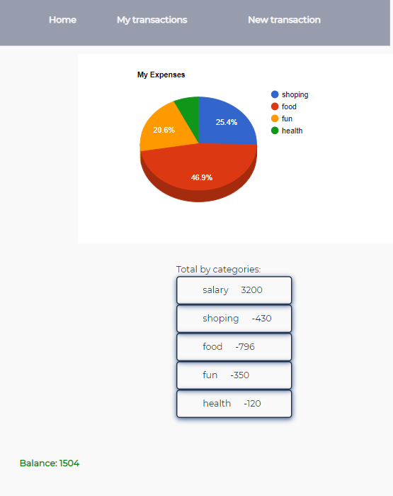
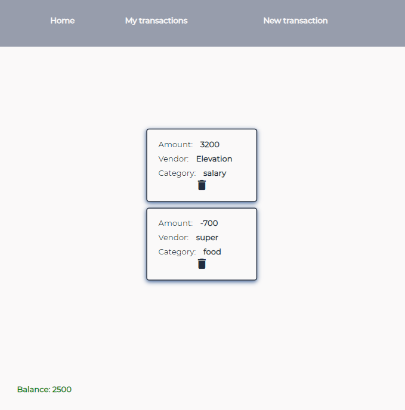
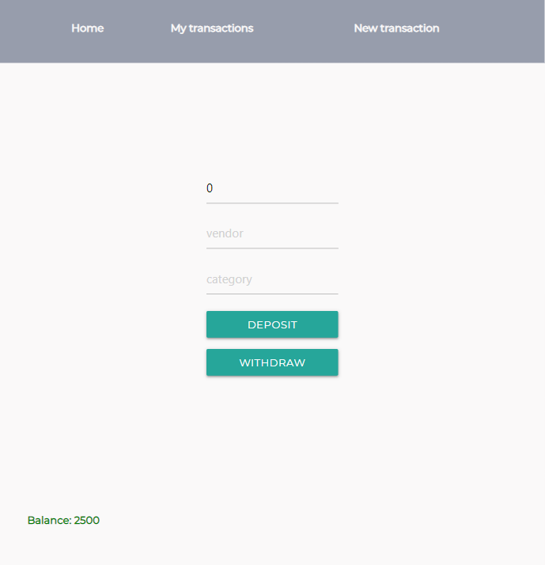

Bank App

Track your account total(expenses and incomes), expenses by category.

Technologies: React, Express, MongoDB, Mongoose, Materialize and pure CSS.

Home page

View all expenses and income totals, chart of all expenses by categories in percentage form. From navigation bar you
can go to all other parts of application.

My Transactions

View all (debit and credit ) transactions. Delete expenses and have a live update of bank total and transactions list.

New transaction

Add expenses/income to the tracker. Specify if it a deposit or withdraw, what the transaction was for and from what category.

